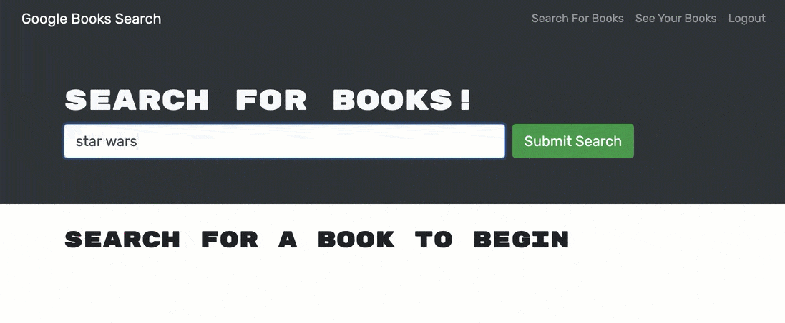

# Book Search

## Description

A web site that allows users to search using a Google API and save books under their created user account. It's a great way to search book titles, and save them to an account to reference for purchase. Allows user to build a collection of favorite books. This project uses Apollo Server, and applies the MERN stack with a React front end, Mongo DB database, and Node JS/Express.js server and API.

## Installation

There is no install, the site is accessed via URL.

## Usage

Live URL: https://fast-hollows-71667.herokuapp.com/

Visit the site, create an account or log in. Search book titles, and save them to your favorites. All books saved will be stored in your account for future visits. Books can be removed from your favorites as desired.

Preview of search field

Preview of save or already saved button

Preview of number of saved books

preview of delete book option

## Credits

N/A

## License

MIT, Please refer to the license in the Repo.

